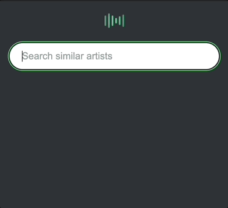
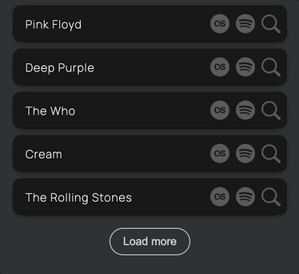

# Discoverify

Search for artists and list similar artists from Last.fm database and their top songs from Spotify.

## Installation
1. Run `npm install`
2. Create [`Last.fm API account`](https://www.last.fm/api) and add your API key to the `.env.local` file.
2. Create [`Spotify API Application`](https://developer.spotify.com/documentation/web-api/concepts/apps) and add your Client ID and Client Secret to the `.env.local` file.

## Running the application
- Run the developement server: `npm run dev`
- Open [`http://localhost:3000`](http://localhost:3000) in your browser.

## UI

Search for an artist and the application will list the five most similar artists based on your search.

You can search and combine multiple artists by separating the artist names with a comma.
If the artist name has a comma in it you can add quote marks around it and it handles the artist search correctly.

There are direct links to the artist's page on Last.fm and Spotify application.

Clicking on the magnifying glass icon you can add that artist directly to the search input.

You can click to show more similar artists in the list and expand the artist element to see the top five most popular songs for that artist.

Clicking on a song the application opens Spotify and starts playing that song.

